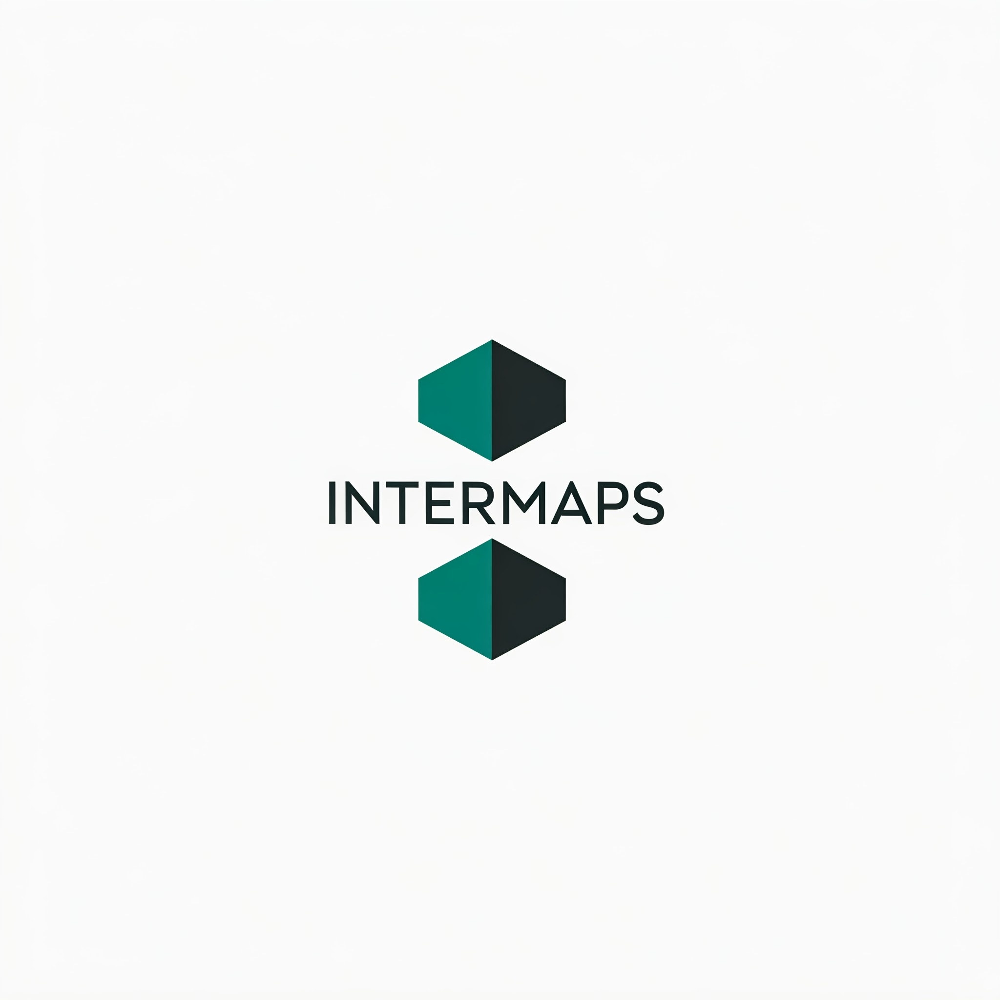

# InterMaps

El objetivo principal del proyecto es desarrollar una aplicación móvil diseñada para calcular rutas entre distintos puntos de interés. La app personaliza la experiencia del usuario considerando sus preferencias de métodos de 
transporte y permite explorar opciones de trayectos, como rutas más rápidas, más cortas o más económicas. Además, proporciona información detallada sobre costos asociados, simplificando la planificación de viajes de manera accesible y rápida.

El desarrollo de InterMaps se realiza con la metodología ATDD (Acceptance Test-Driven Development), utilizando pruebas de aceptación para guiar el desarrollo e iteraciones pequeñas y graduales. 

Integramos APIs de servicios públicos para datos de rutas, geolocalización y costos, y empleamos una base de datos no relacional para garantizar eficiencia y escalabilidad.

## Licencia

[Apache License 2.0](https://www.apache.org/licenses/LICENSE-2.0)

## Documentación del proyecto

[Documentación proyecto InterMaps](https://docs.google.com/document/d/1AaItw1LvdEPpoE_Y5MR0k56FwDgwDUF72EuUrwo6sfQ/edit?usp=sharing)

## Tecnologias utilizadas

**Backend:**

    Kotlin

    Mockito

    JUnit 4

    Firebase Authentication y Firestore

**Frontend:**

    Jetpack Compose

**APIs:**

    Mapbox SDK

    Openrouteservice API

    Datos.gob.es API

    Apidatos.ree.es

    Retrofit
## Instalación

Descarga la APK de InterMaps: [Enlace APK](https://drive.google.com/file/d/1FPb14ANET_CqQphbQPwAgS9vmW6MfT1g/view?usp=sharing)

Instala la APK en tu dispositivo movil. 

¡Buen viaje!
    
## Uso basico de la aplicación

- **Abre** la aplicación en tu dispositivo.
- **Crea** una cuenta en InterMaps o inicia sesión
- **Navega** con el mapa o busca un lugar que quierás buscar.
- **Guarda** tus lugares de interés con el nombre que más te guste.
- Elige dos puntos de interés y **crea una ruta** según tus preferencias. ¡Puedes guardarla si te ha gustado!
- Disfruta de la experiencia :)

## Autores

- [Jorge Villalonga](https://github.com/tyraelkis)
- [Guillem Rosell](https://github.com/GuilleRosSal)
- [Sara Calvente](https://github.com/SaraCalvente)
- [Carlos Flores](https://github.com/carlosfj7)

## Agradecimientos

Queremos agradecer a todos los profesores implicados en las asignaturas relacionadas con el proyecto por su trabajo e implicación en el mismo.

- Ramón Alberto Molineda Cardenas, Profesor en la UJI de la asignatura 1048.

- [Miguel Matey Sanz](https://github.com/matey97), Profesor en la UJI de los laboratorios de las asignatura 1048/1039.

- [Carlos Granell Canut](https://github.com/cgranell), Profesor en la UJI de la asignatura 1039.